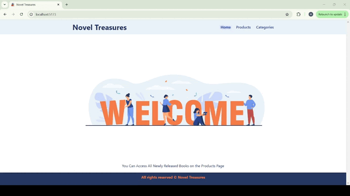

# Novel Treasures 
This project provides a user-friendly experience that users can search, filter, sort and view detailed information about novels. 
# Technologies used in this project
💥 React.js: Used for building the user interface and implementing a component-based architecture.

💥React Router v6: Enabled smooth page navigation and nested routes.

💥useState & useEffect: Leveraged React hooks for state management and dynamic API data fetching.

💥useSearchParams & useNavigate: Managed URL parameters for search and filter functionalities.

💥Axios: Used for making API calls to fetch and display data.

Vite: A modern build tool for a faster development process.

💥CSS: Styled the user interface to create a sleek and responsive design. 
# Preview of the Project

